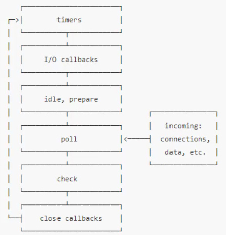

## JS单线程的本质 
> js是单线程。event loop事件循环机制。有六个阶段，分别是timers、I/O callbacks、idle，prepare、poll、check、close callbacks。

  

- timer阶段执行setTimeout和setInterval.
- check阶段执行setImmediate.
```
console.log('script start');
setTimeout(() => {
	console.log('timeout1')
}, 10);
new Promise(resolve => {
	console.log('promise');
	reslove();
	setTimeout(() => {
		console.log('timeout2')
	}, 1);
})
console.log('script end');
```
node运行结果
```
script start
promise
script end
timeout2
timeout1
```
- (macro)task主要包含：script(整体代码)、setTimeout、setInterval、I/O、UI交互事件、postMessage、MessageChannel、setImmediate(Node.js 环境)
- microtask主要包含：Promise.then、MutaionObserver、process.nextTick(Node.js 环境)、Promise 